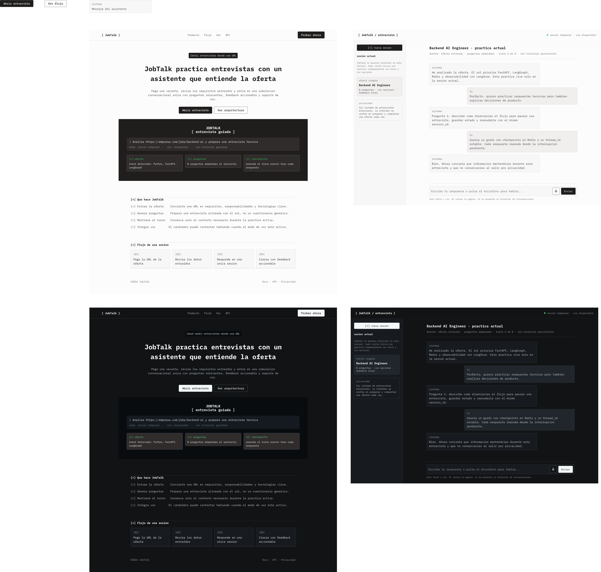
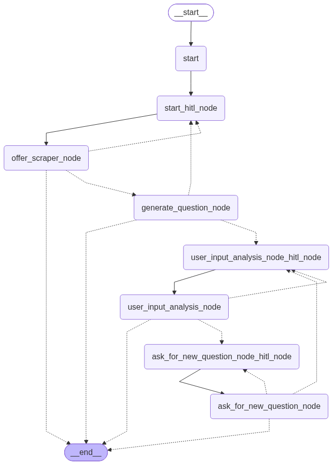

<p align="center">
  
</p>

<h1 align="center">JobTalk</h1>

<p align="center">
  <strong>Practica la entrevista que te espera, no una entrevista genérica.</strong><br />
  Convierte una oferta de empleo en una simulación guiada con preguntas relevantes,
  feedback accionable y voz opcional.
</p>

<p align="center">
  <a href="https://github.com/JuanjoLopez19/job-offer-talk/actions/workflows/deploy-pages.yml"></a>
  
  
  
  
  <a href="LICENSE"></a>
</p>

<p align="center">
  <a href="#español">Español</a> · <a href="#english">English</a>
</p>

<a id="español"></a>

## Una oferta. Una práctica hecha a medida.

Las entrevistas cambian según el puesto, la empresa y el nivel esperado. JobTalk
analiza la URL de una vacante, identifica su contexto y genera una conversación
de práctica alineada con lo que realmente pide el rol.



> [!NOTE]
> El despliegue de GitHub Pages es una demostración estática de la interfaz. Para
> ejecutar entrevistas reales se necesita el backend de FastAPI, Redis y un
> proveedor de LLM configurado.

## Por qué JobTalk

| Necesitas | JobTalk aporta |
| --- | --- |
| Entender una vacante extensa | Extrae el título, la empresa, el resumen y las tecnologías relevantes desde su URL. |
| Preparar preguntas realistas | Genera hasta diez preguntas específicas para la oferta, redactadas en español. |
| Mejorar cada respuesta | Analiza relevancia, precisión y profundidad para ofrecer feedback y continuar la entrevista. |
| Practicar de forma natural | Permite responder por texto o voz y escuchar al entrevistador mediante TTS. |
| Mantener el hilo | Reanuda cada turno desde checkpoints asociados a la sesión. |
| Elegir infraestructura | Admite Google Gemini, OpenAI, Anthropic y modelos locales mediante Ollama. |

## Cómo funciona

1. **Pega la URL.** JobTalk valida y extrae la información de la oferta.
2. **Obtén el contexto.** El sistema resume el puesto y detecta sus palabras clave.
3. **Practica pregunta a pregunta.** El entrevistador adapta la conversación a la
   oferta y a tus respuestas.
4. **Recibe feedback.** Cada turno aporta una evaluación específica antes de
   avanzar o pedir más detalle.

La experiencia se apoya en interrupciones human-in-the-loop de LangGraph. Cada
respuesta reanuda el grafo en el punto exacto donde esperaba al candidato.

## Arquitectura

```text
React + Vite
   ├── HTTP  POST /v1/graph/                 texto y estado de entrevista
   └── WS    /v1/conversation/{session_id}  audio, transcripción y TTS
                         │
                    FastAPI
                         │
      welcome → offer scraper → question generator → interview loop
                         │
        Redis checkpoints · Langfuse observability · LLM provider
```

El grafo se divide en bienvenida, extracción de oferta y entrevista. Redis
mantiene checkpoints durante una hora por defecto; el servidor serializa las
invocaciones de una misma sesión para evitar turnos concurrentes. La exportación
de `graph.png` es explícita mediante `GraphManager.export_graph()`, por lo que una
petición de producción no escribe diagramas en disco.



## Stack

| Capa | Tecnología |
| --- | --- |
| Interfaz | React 19, TypeScript, Vite, React Router, Radix UI, Lucide |
| API | FastAPI, Pydantic |
| Orquestación | LangGraph con human-in-the-loop |
| Modelos | LangChain con Gemini, OpenAI, Anthropic u Ollama |
| Persistencia | Redis checkpoints con TTL |
| Voz | Faster Whisper (STT) y Kokoro (TTS) |
| Observabilidad | Langfuse y structlog |
| Calidad | pytest, Ruff, Pyrefly, Vitest, Testing Library y Biome |

## Puesta en marcha

### Requisitos

- Python 3.13 o superior y [uv](https://docs.astral.sh/uv/).
- Node.js 24 y pnpm 12.
- Redis accesible desde el backend.
- Credenciales de Langfuse y de un proveedor de LLM, salvo que uses Ollama.
- CPU o CUDA para los modelos de voz.

### Instalación

```powershell
git clone https://github.com/JuanjoLopez19/job-offer-talk.git
Set-Location job-offer-talk

# Backend con el proveedor predeterminado de Google
uv sync --dev --extra google

# Frontend y hook de Husky
pnpm install

Copy-Item .env.example .env
```

Los extras disponibles son `google`, `openai`, `anthropic`, `ollama` y `all`.
Guarda secretos locales en `.env.local`; tiene prioridad sobre `.env` y ambos
archivos están excluidos de Git.

### Configuración mínima

El ejemplo incluido usa Gemini:

```dotenv
REDIS__URL=redis://localhost:6379/0

LANGFUSE_SECRET_KEY=
LANGFUSE_PUBLIC_KEY=
LANGFUSE_BASE_URL=https://cloud.langfuse.com

LLM_PROVIDER=google
GOOGLE_API_KEY=tu_clave
GOOGLE_MODEL=gemini-3.7-flash

STT__MODEL_NAME=medium
STT__DEVICE=cpu
TTS__VOICE=em_alex
TTS__DEVICE=cpu
```

Para otro proveedor, instala su extra, cambia `LLM_PROVIDER` y define su clave y
modelo correspondientes. Ollama no requiere una clave remota.

### Desarrollo local

Inicia Redis y abre dos terminales:

```powershell
# Terminal 1 · API y documentación OpenAPI en http://127.0.0.1:8000/docs
uv run fastapi dev app/app.py

# Terminal 2 · frontend en http://127.0.0.1:5173
pnpm dev:frontend
```

Vite redirige `/v1` —incluidos WebSockets— hacia FastAPI. En producción, sirve
`frontend/dist` desde un servidor estático y configura el mismo proxy; FastAPI no
sirve el frontend.

## API y sesiones

- `POST /v1/graph/` inicia o continúa una conversación de texto.
- `WS /v1/conversation/{session_id}` intercambia audio, transcripciones y
  respuestas del asistente.
- `X-Thread-ID` identifica el checkpoint. Debe conservarse entre turnos y admite
  entre 1 y 128 caracteres.
- El audio aceptado es MP4, OGG, WAV o WebM, con un máximo de 10 MB por turno.

Ejemplo de inicio:

```powershell
$body = @{ session_id = "mi-sesion"; user_input = $null } | ConvertTo-Json

Invoke-RestMethod `
  -Method Post `
  -Uri "http://127.0.0.1:8000/v1/graph/" `
  -ContentType "application/json" `
  -Body $body
```

## Calidad

```powershell
uv run ruff format --check .
uv run ruff check .
uv run pyrefly check
uv run pytest
pnpm check
pnpm test:frontend
pnpm build
```

`pnpm install` configura Husky. El hook de pre-commit ejecuta las comprobaciones
Python y frontend. También puedes lanzarlas de forma explícita:

```powershell
uv run pre-commit run --all-files
```

## Privacidad y datos

El frontend no guarda un historial de conversaciones en el navegador. El backend
conserva checkpoints temporales en Redis —una hora por defecto— para reanudar la
sesión. El contenido necesario para generar y evaluar preguntas se envía al
proveedor de LLM configurado y la observabilidad se integra con Langfuse; revisa
las políticas de esas plataformas antes de tratar datos sensibles. No se deben
subir secretos, audios generados, modelos ni datos de Redis al repositorio.

## Licencia

JobTalk se distribuye bajo [GNU Affero General Public License v3.0](LICENSE).

---

<a id="english"></a>

<details>
<summary><strong>Read the complete English version</strong></summary>

## One job offer. One tailored practice session.

Interviews change with the role, company, and expected seniority. JobTalk analyzes
a vacancy URL, identifies its context, and creates a practice conversation based
on what the position actually requires.

> [!NOTE]
> The GitHub Pages deployment is a static interface showcase. Real interviews
> require the FastAPI backend, Redis, and a configured LLM provider.

## Why JobTalk

| You need | JobTalk provides |
| --- | --- |
| Understand a long vacancy | Extracts the title, company, summary, and relevant technologies from its URL. |
| Prepare realistic questions | Generates up to ten job-specific interview questions in Spanish. |
| Improve every answer | Evaluates relevance, accuracy, and depth to provide feedback and move the interview forward. |
| Practice naturally | Supports typed or spoken answers and optional TTS for the interviewer. |
| Keep the conversation on track | Resumes every turn from session-scoped checkpoints. |
| Choose your infrastructure | Supports Google Gemini, OpenAI, Anthropic, and local models through Ollama. |

## How it works

1. **Paste the URL.** JobTalk validates and extracts the vacancy information.
2. **Get the context.** The system summarizes the role and detects its keywords.
3. **Practice one question at a time.** The interviewer adapts the conversation to
   the offer and your answers.
4. **Receive feedback.** Every turn provides a specific assessment before moving
   forward or asking for more detail.

The experience uses LangGraph human-in-the-loop interruptions. Every answer
resumes the graph exactly where it was waiting for the candidate.

## Architecture

```text
React + Vite
   ├── HTTP  POST /v1/graph/                 text and interview state
   └── WS    /v1/conversation/{session_id}  audio, transcription, and TTS
                         │
                    FastAPI
                         │
      welcome → offer scraper → question generator → interview loop
                         │
        Redis checkpoints · Langfuse observability · LLM provider
```

The graph contains welcome, offer extraction, and interview stages. Redis keeps
checkpoints for one hour by default, while the server serializes invocations for
the same session to prevent concurrent turns. `graph.png` is exported explicitly
through `GraphManager.export_graph()`, so production requests do not write
diagrams to disk.

## Technology

| Layer | Technology |
| --- | --- |
| Interface | React 19, TypeScript, Vite, React Router, Radix UI, Lucide |
| API | FastAPI, Pydantic |
| Orchestration | LangGraph with human-in-the-loop |
| Models | LangChain with Gemini, OpenAI, Anthropic, or Ollama |
| Persistence | Redis checkpoints with TTL |
| Voice | Faster Whisper (STT) and Kokoro (TTS) |
| Observability | Langfuse and structlog |
| Quality | pytest, Ruff, Pyrefly, Vitest, Testing Library, and Biome |

## Getting started

### Requirements

- Python 3.13 or newer and [uv](https://docs.astral.sh/uv/).
- Node.js 24 and pnpm 12.
- Redis reachable from the backend.
- Langfuse and LLM-provider credentials, unless you use Ollama.
- CPU or CUDA for the speech models.

### Installation

```powershell
git clone https://github.com/JuanjoLopez19/job-offer-talk.git
Set-Location job-offer-talk
uv sync --dev --extra google
pnpm install
Copy-Item .env.example .env
```

Available extras are `google`, `openai`, `anthropic`, `ollama`, and `all`. Keep
local secrets in `.env.local`; it overrides `.env`, and both files are ignored by
Git.

### Minimum configuration

The included example uses Gemini:

```dotenv
REDIS__URL=redis://localhost:6379/0
LANGFUSE_SECRET_KEY=
LANGFUSE_PUBLIC_KEY=
LANGFUSE_BASE_URL=https://cloud.langfuse.com
LLM_PROVIDER=google
GOOGLE_API_KEY=your_key
GOOGLE_MODEL=gemini-3.7-flash
STT__MODEL_NAME=medium
STT__DEVICE=cpu
TTS__VOICE=em_alex
TTS__DEVICE=cpu
```

For a different provider, install its extra, update `LLM_PROVIDER`, and define the
matching key and model. Ollama does not require a remote API key.

### Local development

Start Redis, then use two terminals:

```powershell
# Terminal 1 · API and OpenAPI docs at http://127.0.0.1:8000/docs
uv run fastapi dev app/app.py

# Terminal 2 · frontend at http://127.0.0.1:5173
pnpm dev:frontend
```

Vite proxies `/v1`, including WebSockets, to FastAPI. In production, serve
`frontend/dist` from a static server and configure the same proxy; FastAPI does
not serve the frontend.

## API and sessions

- `POST /v1/graph/` starts or continues a text conversation.
- `WS /v1/conversation/{session_id}` exchanges audio, transcripts, and assistant
  responses.
- `X-Thread-ID` identifies the checkpoint. Preserve it between turns; its length
  must be between 1 and 128 characters.
- Accepted audio formats are MP4, OGG, WAV, and WebM, up to 10 MB per turn.

## Quality

```powershell
uv run ruff format --check .
uv run ruff check .
uv run pyrefly check
uv run pytest
pnpm check
pnpm test:frontend
pnpm build
uv run pre-commit run --all-files
```

## Privacy and data

The frontend does not keep conversation history in the browser. The backend
stores temporary Redis checkpoints —one hour by default— so a session can resume.
Content required to generate and evaluate questions is sent to the configured LLM
provider, and observability integrates with Langfuse. Review those platforms'
policies before processing sensitive data. Do not commit secrets, generated
audio, model files, or Redis data.

## License

JobTalk is released under the [GNU Affero General Public License v3.0](LICENSE).

</details>
